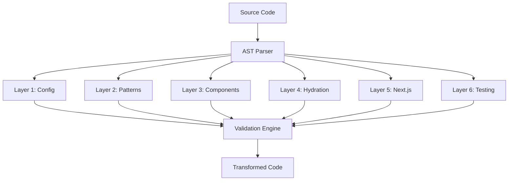

# Introduction to NeuroLint

Welcome to NeuroLint, the next-generation platform for intelligent code analysis and transformation. Whether you're a seasoned developer looking to optimize your workflow or a team lead ensuring code quality across projects, NeuroLint provides the tools you need to elevate your codebase.

## What Makes NeuroLint Special?

NeuroLint isn't just another linting tool—it's a comprehensive transformation platform that combines **rule-based analysis** with **AST (Abstract Syntax Tree) parsing** to deliver unprecedented code improvement capabilities.

### 🔬 **Deep Analysis**
Our 6-layer analysis engine examines your code from multiple perspectives:
- **Configuration level** - Project setup and tooling
- **Pattern level** - Code patterns and anti-patterns  
- **Component level** - React/framework-specific improvements
- **Runtime level** - SSR, hydration, and performance concerns
- **Architecture level** - Modern framework patterns
- **Quality level** - Testing, validation, and best practices

### 🛡️ **Safety First**
Every transformation is validated to ensure your code remains functional:
- **AST-based transformations** prevent syntax errors
- **Incremental validation** catches issues early
- **Automatic rollback** on validation failures
- **Backup creation** before any changes

### 🚀 **Multiple Interfaces**
Choose the interface that fits your workflow:
- **Web Application** - Interactive, visual interface
- **CLI Tool** - Command-line for automation and CI/CD
- **VS Code Extension** - Real-time analysis in your editor
- **REST API** - Custom integrations and applications

## Who Should Use NeuroLint?

### 👨‍💻 **Individual Developers**
- Improve code quality and consistency
- Learn best practices through automated suggestions
- Modernize legacy codebases efficiently
- Save time on repetitive refactoring tasks

### 👥 **Development Teams**
- Enforce consistent coding standards
- Onboard new developers with guided improvements
- Reduce code review time with automated fixes
- Maintain quality across multiple projects

### 🏢 **Enterprise Organizations**
- Ensure compliance with coding standards
- Scale code quality initiatives across departments
- Generate comprehensive reports and audits
- Integrate with existing development workflows

## Supported Technologies

NeuroLint is optimized for modern web development stacks:

### ✅ **Fully Supported**
- **React** (16.8+) - Components, hooks, patterns
- **Next.js** (12+) - App Router, Pages Router, SSR/SSG
- **TypeScript** (4.5+) - Type checking, configuration
- **JavaScript** (ES2020+) - Modern syntax and features

### 🔧 **Partial Support**
- **Vue.js** - Basic component analysis
- **Svelte** - Component pattern recognition
- **Node.js** - Backend code patterns
- **Express** - Server-side improvements

### 📋 **Configuration Files**
- `tsconfig.json` - TypeScript configuration
- `next.config.js` - Next.js configuration  
- `package.json` - Dependencies and scripts
- `.neurolint.json` - NeuroLint settings

## How NeuroLint Works

### 1. **Code Analysis**
NeuroLint parses your code into an Abstract Syntax Tree (AST) and analyzes it across multiple dimensions:



### 2. **Intelligent Processing**
Each layer applies specific transformations based on detected patterns:

- **Rule-based matching** identifies improvement opportunities
- **Context awareness** ensures changes are appropriate
- **Dependency tracking** maintains code relationships
- **Safety validation** verifies each transformation

### 3. **Safe Transformation**
Before any code is modified:

1. **Backup creation** preserves original code
2. **Syntax validation** ensures correctness
3. **Logical validation** maintains functionality
4. **User confirmation** for significant changes

## Getting Started Options

Choose your preferred way to start with NeuroLint:

### 🌐 **Web Application** (Recommended for first-time users)
Perfect for trying NeuroLint without any installation:

1. Visit [app.neurolint.dev](https://app.neurolint.dev)
2. Paste your code or upload files
3. Enable Smart Mode for automatic recommendations
4. Process your code and review results

### ⚡ **CLI Installation** (Best for developers)
Ideal for integrating into your development workflow:

```bash
npm install -g @neurolint/cli
neurolint --version
neurolint analyze src/
```

### 🔌 **VS Code Extension** (For real-time feedback)
Get instant analysis as you type:

1. Search "NeuroLint" in VS Code Extensions
2. Install and reload VS Code
3. Open any supported file to see real-time analysis

### 🔧 **API Integration** (For custom solutions)
Build NeuroLint into your applications:

```bash
curl -X POST https://api.neurolint.dev/api/v1/analyze \
  -H "Authorization: Bearer YOUR_TOKEN" \
  -H "Content-Type: application/json" \
  -d '{"code": "const x = 1;", "layers": [1,2,3]}'
```

## What's Next?

Ready to dive in? Here's your recommended learning path:

1. **[Quick Start Guide](/getting-started/quick-start)** - Get up and running in 5 minutes
2. **[First Analysis](/getting-started/first-analysis)** - Run your first code analysis
3. **[Understanding Layers](/getting-started/understanding-layers)** - Learn how the layer system works
4. **[Core Concepts](/concepts/layer-system)** - Deep dive into NeuroLint's architecture

## Need Help?

We're here to support your journey with NeuroLint:

- **📖 Documentation** - Comprehensive guides and references
- **💬 Community Forum** - [forum.neurolint.dev](https://forum.neurolint.dev)
- **📧 Direct Support** - [founder@neurolint.dev](mailto:founder@neurolint.dev)
- **🐛 Bug Reports** - [GitHub Issues](https://github.com/Alcatecable)

---

**Ready to transform your code?** Let's start with the [Quick Start Guide](/getting-started/quick-start)!